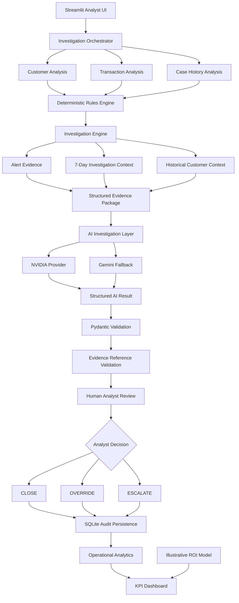

# FinGuard — AI-Assisted AML Transaction Monitoring & Human-in-the-Loop Investigation System

A lightweight portfolio prototype demonstrating how deterministic AML transaction-monitoring logic, structured investigation evidence, advisory AI, human decisioning, audit persistence, and operational analytics can be combined into a governed analyst workflow.

## 🚀 Live Demo

### Try the deployed FinGuard application

[](https://finguard-aml-transaction-monitoring-88aysmsxczluqrefgm4xkw.streamlit.app/)

**👉 [Open FinGuard on Streamlit Cloud](https://finguard-aml-transaction-monitoring-88aysmsxczluqrefgm4xkw.streamlit.app/)**

The deployed prototype demonstrates the complete analyst workflow:

```text
Select Alert
    ↓
Run Investigation
    ↓
Review Evidence Package
    ↓
Generate AI Investigation
    ↓
Review AI Recommendation
    ↓
Human CLOSE / OVERRIDE / ESCALATE
    ↓
SQLite Audit Persistence
    ↓
Automatic KPI + Audit Trail Refresh
```

### What you can try

- Select a synthetic AML alert from the investigation queue.
- Run the deterministic investigation.
- Review alert evidence, investigation context, risk indicators, and historical customer context.
- Generate an evidence-based AI investigation.
- Review the AI risk assessment and recommendation.
- Make the final human **CLOSE**, **OVERRIDE**, or **ESCALATE** decision.
- Enter analyst reasoning.
- Submit the decision and observe the KPI dashboard and audit trail update automatically.

> **Demo note:** FinGuard uses synthetic AML data and is an educational portfolio prototype. It is not a production AML compliance system. AI output is advisory only and the human analyst retains final decision authority.

---

## 1. Project Overview

FinGuard is a Business Analyst + AI portfolio prototype designed to demonstrate how an AML Transaction Monitoring investigation workflow can be improved through structured evidence gathering, deterministic rule analysis, advisory AI, human-in-the-loop decisioning, audit persistence, operational analytics, and business-case modelling.

The project addresses the following business question:

> How can an AI-assisted investigation workflow help a Level-1 AML analyst investigate transaction-monitoring alerts more efficiently while keeping the analyst in control of the final decision and maintaining traceability of the evidence used?

The solution follows a deliberately governed sequence:

```text
Data
  ↓
Deterministic Rules
  ↓
Investigation Evidence
  ↓
AI Interpretation
  ↓
Human Decision
  ↓
Audit Persistence
  ↓
Operational Analytics / Business Case
```

The core design principle is:

> **AI assists. Humans decide.**

Deterministic Python logic establishes the factual transaction and rule evidence. The AI interprets that structured evidence into a constrained investigation summary and recommendation. The analyst reviews the evidence and makes the final CLOSE, OVERRIDE, or ESCALATE decision.

---

## 2. Business Problem

Transaction-monitoring alerts require analysts to bring together multiple forms of information before reaching a case decision.

Even in a simplified workflow, the analyst may need to understand:

- why the alert was generated;
- which transactions constitute the alert evidence;
- what the customer's normal transaction profile looks like;
- whether additional suspicious indicators appear in the investigation window;
- whether the customer has relevant historical case context; and
- how to document and justify the final decision.

A workflow that requires these activities to be performed manually can create repetitive evidence-gathering and documentation work.

FinGuard therefore focuses on improving the workflow around:

```text
Evidence Assembly
       ↓
Contextual Analysis
       ↓
AI-Assisted Synthesis
       ↓
Human Decision
       ↓
Auditability
```

The primary user represented in the prototype is a:

**Level-1 AML / Transaction Monitoring Analyst**

---

## 3. Solution

FinGuard provides a Streamlit-based investigation workspace in which an analyst can:

- select an alert;
- inspect the alert trigger and evidence;
- review customer context;
- evaluate deterministic transaction-monitoring indicators;
- inspect a 7-day investigation window;
- review historical customer case context;
- generate an advisory AI investigation;
- inspect structured AI findings and evidence references;
- make a human CLOSE, OVERRIDE, or ESCALATE decision;
- provide mandatory analyst rationale;
- persist the decision to SQLite; and
- view operational analytics.

---

## 4. Architecture



### Architecture at a glance

| Layer | Responsibility |
|---|---|
| Streamlit UI | Analyst-facing investigation workflow |
| Investigation Orchestrator | Coordinates investigation components |
| Customer / Transaction / Case Analysis | Prepares structured business context |
| Rules Engine | Deterministic AML indicator evaluation |
| Investigation Engine | Builds evidence and investigation context |
| AI Investigation Layer | Interprets structured evidence |
| Validation | Validates structured AI output and evidence references |
| HITL Layer | Human analyst makes final decision |
| SQLite | Persists completed decision metadata |
| Analytics | Provides operational KPI views |
| ROI Model | Estimates potential business value from explicit assumptions |

---

## 5. Core Design Principle — AI Assists, Humans Decide

A central design decision in FinGuard is to avoid an architecture where:

```text
Transaction Data → LLM → Final Decision
```

Instead:

```text
Transaction Data
      ↓
Deterministic Rules
      ↓
Evidence Package
      ↓
AI Interpretation
      ↓
Human Review
      ↓
Final Decision
```

The AI is intentionally not the source of truth for:

- transaction values;
- rule thresholds;
- arithmetic;
- customer records;
- evidence availability; and
- final case disposition.

The AI's role is to synthesize and explain already-assembled evidence.

The final decision remains with the human analyst.

---

## 6. Prototype Scope & Key Design Decisions

### 6.1 Why Synthetic Data?

The prototype uses a purpose-built synthetic AML dataset so that the complete workflow can be demonstrated without using real customer information or confidential banking data.

The dataset is relational and contains:

- customers;
- transactions;
- alerts;
- historical cases; and
- canonical investigation scenarios.

No real customer transactions are required.

### 6.2 Can the Dataset Be Replaced?

Yes — with an important architectural qualification.

The application is schema-dependent rather than dataset-value-dependent.

The current prototype is designed around a canonical AML data contract covering concepts such as:

- customer;
- transaction;
- alert;
- historical case; and
- scenario metadata.

A different dataset can be supported by mapping and validating its source fields into that canonical schema.

Conceptually:

```text
External Data Source
        ↓
Data Ingestion / Schema Mapping
        ↓
Canonical AML Data Contract
        ↓
Rules Engine
        ↓
Investigation Engine
        ↓
AI + HITL Workflow
```

The current v1.0 implementation has been validated against the canonical synthetic dataset.

A generalized ingestion/schema-mapping layer for arbitrary external source schemas is identified as a future enhancement.

### Interview-ready explanation

> "Yes, provided the incoming data is mapped to the application's canonical data contract. The current prototype is schema-dependent rather than dataset-specific: the rules and investigation engine operate on defined customer, transaction, alert and case-history fields rather than on the specific synthetic records I created. For a new source, I would introduce a data-ingestion and normalization layer that maps the source schema into the canonical schema and validates the required fields and data types."

### 6.3 Why Deterministic Rules Before AI?

The transaction-monitoring indicators are implemented in Python rather than delegated to the LLM.

This provides:

- repeatable rule behavior;
- transparent thresholds;
- easier testing;
- explainable evidence;
- separation of calculation from interpretation; and
- stronger governance around AI usage.

The LLM therefore operates downstream of the deterministic evidence layer.

### 6.4 Why Human-in-the-Loop?

The prototype deliberately separates:

**AI recommendation**

from

**human disposition**

The analyst must explicitly select:

```text
CLOSE
OVERRIDE
ESCALATE
```

and provide a rationale before the decision can be persisted.

This prevents the AI recommendation from becoming an automatic case outcome.

### 6.5 What Is This Project — and What Is It Not?

FinGuard is a portfolio-scale prototype, not a production banking platform.

### Included

- AML transaction-monitoring rules;
- relational synthetic data;
- alert investigation;
- investigation-context construction;
- historical customer context;
- structured evidence package;
- advisory AI;
- AI output validation;
- evidence-reference validation;
- human-in-the-loop decisioning;
- SQLite audit persistence;
- operational analytics; and
- illustrative ROI modelling.

### Not included

- real-time transaction blocking;
- autonomous alert closure;
- autonomous regulatory filing;
- live sanctions / PEP / KYC integrations;
- production core-banking integration;
- enterprise IAM / SSO;
- high-availability infrastructure;
- distributed production databases;
- production-grade model governance infrastructure; and
- real customer data.

The architecture is intentionally lightweight so that the project demonstrates business and control logic rather than unnecessary enterprise infrastructure.

---

## 7. Business Analysis Perspective

FinGuard is intentionally designed to demonstrate more than coding ability.

The project connects:

```text
Business Problem
      ↓
Stakeholders
      ↓
AS-IS Workflow
      ↓
Pain Points
      ↓
TO-BE Workflow
      ↓
Requirements
      ↓
Solution Design
      ↓
AI Governance
      ↓
HITL Controls
      ↓
KPIs
      ↓
Business Case
```

The detailed Business Analysis documentation is available in:

`BA_DOCUMENTATION.md`

It covers:

- problem statement;
- business objectives;
- stakeholder analysis;
- primary user persona;
- AS-IS process;
- TO-BE process;
- pain-point analysis;
- project scope;
- functional requirements;
- non-functional requirements;
- user stories;
- traceability;
- AI governance;
- UAT scenarios;
- analytics;
- ROI;
- limitations; and
- future enhancements.

---

## 8. AS-IS vs TO-BE Workflow

### AS-IS — Conceptual Baseline

```text
Alert Generated
      ↓
Analyst Opens Alert
      ↓
Find Customer Profile
      ↓
Review Alert Transaction(s)
      ↓
Inspect Relevant Transaction History
      ↓
Consider Rule / Scenario Trigger
      ↓
Check Historical Customer Context
      ↓
Synthesize Findings
      ↓
Write Investigation Rationale
      ↓
Close / Override / Escalate
      ↓
Record Case Decision
```

This is a conceptual Business Analysis baseline used to identify manual touchpoints.

It is not presented as a measured description of a specific bank's production process.

### TO-BE — FinGuard Workflow

```text
Alert Queue
      ↓
Select Alert
      ↓
Customer + Alert Evidence
      ↓
Deterministic Rule Evaluation
      ↓
7-Day Investigation Context
      ↓
Historical Customer Context
      ↓
Structured Evidence Package
      ↓
AI Investigation
      ↓
Evidence-Reference Validation
      ↓
Human Analyst Review
      ↓
CLOSE / OVERRIDE / ESCALATE
      ↓
SQLite Audit Persistence
      ↓
Automatic KPI / Audit Trail Refresh
      ↓
KPI / Analytics View
```

The intended business benefits are:

- less manual evidence assembly;
- consistent application of rule logic;
- explicit separation between AI recommendation and human decision;
- clearer evidence references;
- structured case documentation; and
- easier post-case analysis.

---

## 9. Key Functional Capabilities

### Alert Investigation

The analyst can select an alert and inspect:

- alert type;
- trigger rule;
- evidence transactions;
- customer information;
- investigation context;
- contextual indicators; and
- historical case context.

### Deterministic Transaction Monitoring

Five transaction-monitoring indicators are implemented in:

`app/rules_engine.py`

### Investigation Context

The investigation engine builds a structured evidence package around the alert event.

The default investigation window is:

**7 days**

Historical customer case context is handled separately.

### Advisory AI

The application can route structured evidence to:

- NVIDIA as the current primary provider;
- Gemini as the configured fallback provider.

### Human-in-the-Loop

The analyst reviews the evidence and advisory result before selecting the final decision.

### Audit Persistence

Completed HITL decisions are persisted to SQLite.

### Operational Analytics

The application calculates summaries such as:

- total cases;
- decision distribution;
- AI risk distribution;
- AI recommendation vs human outcome;
- override rate;
- escalation rate;
- provider distribution; and
- case volumes by date.

### ROI Model

An adjustable model estimates potential labor-efficiency impact from explicit assumptions.

---

## 10. AML Rule Engine

All five rules are deterministic Python functions.

| Rule ID | Rule | Current Logic |
|---|---|---|
| RL-01 | HIGH VELOCITY | 24-hour transaction activity exceeds expected customer activity by 2× |
| RL-02 | BASELINE DEVIATION | Transaction ≥ ₹10,000 and > 2.5× customer profile average |
| RL-03 | AMOUNT CLUSTERING | Minimum 3 transactions within 48 hours with CV < 0.12 |
| RL-04 | RAPID IN-OUT | Inbound ≥ ₹50,000 followed by outbound ≥ ₹40,000 within 12 hours |
| RL-05 | MULTIPLE COUNTERPARTIES | At least 3 distinct counterparties within 24 hours |

### RL-01 — HIGH VELOCITY

**Purpose**

Detect transaction activity above the customer's expected short-term transaction frequency.

**Logic**

Observation window:

**24 hours**

Expected 24-hour transaction count:

```text
monthly_avg_txn_count / 30
```

Trigger condition:

```text
observed_transaction_count
>
expected_24h_count × 2.0
```

This is a customer-relative velocity rule rather than a fixed absolute transaction-count rule.

### RL-02 — BASELINE DEVIATION

**Purpose**

Identify a transaction materially larger than the customer's profile-level average transaction amount.

**Logic**

Customer profile average transaction amount:

```text
monthly_avg_volume / monthly_avg_txn_count
```

Trigger conditions:

```text
transaction amount >= ₹10,000

AND

transaction amount > profile_average × 2.5
```

The implementation uses customer profile fields rather than a separately computed 30-day transaction baseline.

### RL-03 — AMOUNT CLUSTERING

**Purpose**

Detect short-window transaction sets whose amounts are unusually similar.

**Logic**

```text
Lookback window = 48 hours
Minimum transactions = 3
Coefficient of variation < 0.12
```

The rule is therefore based on statistical clustering rather than a hard-coded transaction-value band.

### RL-04 — RAPID IN-OUT

**Purpose**

Identify rapid movement of funds into and then out of the customer account.

**Logic**

```text
Inbound amount >= ₹50,000
Outbound amount >= ₹40,000
Outbound occurs after inbound
Time difference <= 12 hours
```

Direction is determined using sender/receiver relationships:

```text
Customer = receiver_id → inbound

Customer = sender_id   → outbound
```

### RL-05 — MULTIPLE COUNTERPARTIES

**Purpose**

Identify short-window activity involving several distinct counterparties.

**Logic**

```text
Lookback window = 24 hours
Minimum distinct counterparties = 3
```

The rule triggers when at least three distinct counterparties are observed.

---

## 11. Canonical AML Scenarios

Three canonical scenarios are maintained for controlled validation of the rules and investigation workflow.

### SCN_001 — Baseline Deviation

```text
Alert:       ALT-0001
Customer:    CUST-0001
Alert Type:  BASELINE_DEVIATION
Trigger:     RL-02
Evidence:    TXN-11988
Risk Tier:   LOW
```

### SCN_002 — Amount Clustering

```text
Alert:       ALT-0002
Customer:    CUST-0002
Alert Type:  AMOUNT_CLUSTERING
Evidence:    TXN-11989 ... TXN-11996
Risk Tier:   MEDIUM
```

The validated investigation context contains additional contextual indicators including RL-01, RL-02 and RL-05.

### SCN_003 — Rapid In-Out

```text
Alert:       ALT-0003
Customer:    CUST-0003
Alert Type:  RAPID_IN_OUT
Evidence:    TXN-11997 ... TXN-12000
Risk Tier:   HIGH
```

RL-04 is triggered in the validated investigation workflow.

---

## 12. Investigation Engine

The investigation engine is implemented in:

`app/investigation_engine.py`

It organizes the investigation around three evidence rings.

### Ring 1 — Alert Evidence

The engine resolves the alert's:

`evidence_transaction_ids`

and identifies the transactions explicitly associated with the alert.

Missing evidence references are tracked rather than silently ignored.

### Ring 2 — Investigation Context

The engine anchors the investigation to the alert evidence timestamp and retrieves transactions for the customer within the default:

**7-day investigation window**

This context is used to determine whether additional indicators are present around the alert event.

### Ring 3 — Historical Customer Context

The engine retrieves:

- customer profile information;
- prior case count;
- historical dispositions; and
- relevant escalation context.

Historical case context is treated as contextual evidence rather than simply rerunning transaction rules against historical case records.

### Investigation Output

The resulting evidence package contains:

```text
Alert Trigger / Evidence
+
Investigation Context
+
Contextual Rule Indicators
+
Historical Customer Context
```

The package is structured application data rather than free-form prose.

---

## 13. AI-Assisted Investigation

The AI layer receives the structured investigation evidence and produces a constrained advisory response.

### AI Responsibility

The LLM is responsible for:

- interpreting structured evidence;
- synthesizing investigation findings;
- identifying important observations;
- explaining the advisory assessment;
- identifying evidence gaps; and
- suggesting the next review step.

The LLM does not:

- calculate deterministic rule thresholds;
- act as the database of record;
- independently establish transaction evidence;
- write the final case disposition; or
- directly mutate the audit database.

### Provider Strategy

```text
Primary Provider
      ↓
NVIDIA

If primary fails
      ↓
Gemini Fallback
```

The provider is selected through application configuration.

The application stamps the provider used into the final result.

If both configured providers fail, the current orchestration layer raises an application error rather than silently creating a successful no-AI result.

---

## 14. Structured AI Result

The AI output is constrained by the Pydantic model:

`app/ai_schema.py`

The result contains:

| Field | Purpose |
|---|---|
| `investigation_summary` | Concise synthesis of case evidence |
| `risk_assessment` | LOW, MODERATE, HIGH, or INSUFFICIENT_EVIDENCE |
| `key_findings` | Structured findings linked to evidence references |
| `recommended_next_step` | CLOSE_REVIEW, FURTHER_REVIEW, or ESCALATE_FOR_REVIEW |
| `rationale` | Explanation supporting the advisory recommendation |
| `evidence_gaps` | Missing or incomplete information |
| `analyst_warning` | Advisory warning for human review |
| `provider` | Application-stamped provider provenance |

---

## 15. Evidence Reference Validation

AI findings use controlled evidence references.

Supported reference categories include:

```text
TRANSACTION
RULE
CUSTOMER_CONTEXT
HISTORICAL_CONTEXT
```

The application validates these references against the evidence available to the investigation.

The validation sequence is:

```text
Structured Evidence
      ↓
LLM Response
      ↓
Pydantic Schema Validation
      ↓
Evidence Reference Validation
      ↓
Provider Provenance Stamping
      ↓
Human Review
```

This is an important governance control because the AI cannot simply introduce an unsupported evidence identifier into the accepted investigation result.

---

## 16. Human-in-the-Loop Decisioning

The analyst remains the final decision authority.

### Available Decisions

| Decision | Prototype Meaning |
|---|---|
| CLOSE | Analyst determines no further investigation is required |
| OVERRIDE | Analyst deliberately selects a disposition different from the AI recommendation |
| ESCALATE | Analyst decides the case should move to a higher level of review |

A valid HITL decision requires analyst rationale.

The workflow is:

```text
AI Recommendation
       ↓
Human Review
       ↓
Human Decision
       ↓
Persist Decision
       ↓
Automatic KPI / Audit Trail Refresh
```

The application does not automatically create a final case disposition solely from an LLM recommendation.

---

## 17. Audit Persistence

Audit persistence is implemented in:

`app/audit_db.py`

using SQLite.

### Database

```text
data/finguard_audit.db
```

### Current table

```text
audit_records
```

### Current Audit Fields

| Field | Purpose |
|---|---|
| `audit_id` | Audit record identifier |
| `case_id` | Unique case identifier |
| `alert_id` | Source alert identifier |
| `customer_id` | Customer identifier |
| `ai_provider` | Provider used for advisory AI |
| `ai_risk_assessment` | AI advisory risk assessment |
| `ai_recommendation` | AI advisory next step |
| `analyst_decision` | Final human decision |
| `analyst_reason` | Mandatory human rationale |
| `decided_at` | Decision timestamp |
| `recorded_at` | Database-record timestamp |

The current implementation should be described as:

**SQLite-based audit persistence**

It should not be described as a production-grade immutable audit ledger.

---

## 18. Operational Analytics

The analytics layer is implemented in:

`app/analytics.py`

It provides SQL-backed summaries including:

- total cases;
- human decision distribution;
- AI risk distribution;
- AI recommendation vs human outcome;
- override rate;
- escalation rate;
- provider distribution; and
- cases by date.

These metrics demonstrate how completed investigation decisions could support operational reporting.

Prototype analytics should not be interpreted as production performance metrics.

---

## 19. Dataset

The project uses a purpose-built synthetic relational AML dataset.

| File | Purpose | Current Volume |
|---|---|---:|
| `data/customers.csv` | Customer profile data | 300 |
| `data/transactions.csv` | Transaction history | 12,000 |
| `data/alerts.csv` | Alert records | 200 |
| `data/case_history.csv` | Historical case records | 100 |
| `data/scenario_metadata.csv` | Canonical scenarios | 3 |

### Dataset Characteristics

The dataset is intentionally relational so that the prototype demonstrates:

- customer-level analysis;
- transaction-level analysis;
- alert-to-transaction relationships;
- customer-to-case-history relationships;
- scenario-based testing; and
- evidence-reference validation.

### Synthetic Data Only

The dataset is intended exclusively for:

- development;
- testing;
- demonstration; and
- portfolio presentation.

It does not represent real banking customer activity.

---

## 20. Technology Stack

| Technology | Purpose |
|---|---|
| Python 3.12 | Application logic |
| Pandas | Data processing |
| Streamlit | Analyst UI |
| SQLite | Audit persistence |
| Pydantic | Structured AI validation |
| NVIDIA API | Primary AI provider |
| Gemini API | Fallback AI provider |
| python-dotenv | Environment configuration |
| Git / GitHub | Version control and portfolio presentation |

---

## 21. Project Structure

```text
FinGuard/
│
├── app/
│   ├── __init__.py
│   ├── ai_investigation.py
│   ├── ai_schema.py
│   ├── analytics.py
│   ├── audit_db.py
│   ├── hitl_decision.py
│   ├── investigation_engine.py
│   ├── roi_model.py
│   ├── rules_engine.py
│   ├── streamlit_app.py
│   │
│   └── ai_providers/
│       ├── base.py
│       ├── gemini_provider.py
│       └── nvidia_provider.py
│
├── data/
│   ├── customers.csv
│   ├── transactions.csv
│   ├── alerts.csv
│   ├── case_history.csv
│   └── scenario_metadata.csv
│
├── scripts/
│   ├── generate_dataset.py
│   ├── seed_demo_audit.py
│   ├── test_ai_investigation.py
│   ├── test_analytics.py
│   ├── test_audit_db.py
│   ├── test_end_to_end_hitl.py
│   ├── test_hitl_decision.py
│   ├── test_investigation_engine.py
│   ├── test_rules_engine.py
│   ├── update_scenario_metadata.py
│   └── validate_dataset.py
│
├── docs/
│   └── architecture.mmd
│
├── BA_DOCUMENTATION.md
├── README.md
├── requirements.txt
├── .env.example
└── .gitignore
```

---

## 22. How to Run

### 22.1 Clone the Repository

```bash
git clone <your-repository-url>
cd FinGuard
```

### 22.2 Create a Virtual Environment

#### Windows PowerShell

```powershell
python -m venv .venv
.\.venv\Scripts\Activate.ps1
```

#### Linux / macOS

```bash
python -m venv .venv
source .venv/bin/activate
```

### 22.3 Install Dependencies

```bash
pip install -r requirements.txt
```

### 22.4 Configure Environment Variables

Copy:

```text
.env.example
```

to:

```text
.env
```

Then configure the AI provider credentials.

Example structure:

```env
# FinGuard AI Provider Configuration

NVIDIA_API_KEY=
GEMINI_API_KEY=

AI_PRIMARY_PROVIDER=nvidia
AI_FALLBACK_PROVIDER=gemini

NVIDIA_MODEL=
GEMINI_MODEL=
```

Never commit `.env` or real API keys to GitHub.

The repository should contain `.env.example`, not actual credentials.

### 22.5 Launch Streamlit

```powershell
streamlit run .\app\streamlit_app.py
```

The application will open locally in the browser.

---

## 23. Validation

The prototype has been validated through:

- Python compilation checks;
- synthetic dataset validation;
- deterministic rules testing;
- investigation-engine testing;
- HITL decision testing;
- analytics testing;
- end-to-end HITL testing;
- AI investigation testing; and
- ROI model execution.

### Representative validation commands

#### Python compilation

```powershell
python -m py_compile .\app\ai_schema.py
python -m py_compile .\app\ai_investigation.py
python -m py_compile .\app\ai_providers\base.py
python -m py_compile .\app\ai_providers\nvidia_provider.py
python -m py_compile .\app\ai_providers\gemini_provider.py
python -m py_compile .\app\rules_engine.py
python -m py_compile .\app\investigation_engine.py
python -m py_compile .\app\hitl_decision.py
python -m py_compile .\app\audit_db.py
python -m py_compile .\app\analytics.py
python -m py_compile .\app\roi_model.py
python -m py_compile .\app\streamlit_app.py
```

#### Dataset validation

```powershell
python .\scripts\validate_dataset.py
```

#### Rules

```powershell
python -m scripts.test_rules_engine
```

#### Investigation engine

```powershell
python -m scripts.test_investigation_engine
```

#### HITL

```powershell
python -m scripts.test_hitl_decision
```

#### Analytics

```powershell
python -m scripts.test_analytics
```

#### ROI

```powershell
python -m app.roi_model
```

The core compilation, dataset validation, rules, investigation, HITL and analytics checks have been exercised locally.

---

## 24. Illustrative ROI Model

The project includes an adjustable business-case model in:

`app/roi_model.py`

The current default assumptions are illustrative:

| Assumption | Value |
|---|---:|
| Monthly alerts | 200 |
| Current investigation effort | 90 min / alert |
| AI-assisted effort | 30 min / alert |
| Analyst cost | ₹800 / hour |
| Implementation cost | ₹250,000 |

Under these assumptions, the model calculates:

### Current effort

```text
300 hours/month
```

### AI-assisted effort

```text
100 hours/month
```

### Estimated hours saved

```text
200 hours/month
```

### Estimated monthly labor savings

```text
₹160,000
```

### Estimated annual labor savings

```text
₹1,920,000
```

### Estimated net annual benefit

```text
₹1,670,000
```

### Illustrative ROI

```text
668%
```

### Illustrative payback

```text
1.56 months
```

These figures are model outputs based on explicit assumptions, not measured production results or claims about an actual bank's operating performance.

---

## 25. Business Analyst / Product Perspective

The project is intended to demonstrate a complete BA-to-prototype thought process:

```text
Business Problem
      ↓
Stakeholders
      ↓
AS-IS Workflow
      ↓
Pain Points
      ↓
TO-BE Workflow
      ↓
Requirements
      ↓
Solution Design
      ↓
AI Governance
      ↓
HITL Controls
      ↓
KPIs
      ↓
Business Case
```

This makes the project relevant not only as a coding exercise, but also as a demonstration of:

- business problem framing;
- process analysis;
- requirements thinking;
- solution architecture;
- AML domain understanding;
- AI governance;
- human oversight;
- KPI design; and
- business-case modelling.

---

## 26. Interview-Relevant Design Decisions

### Why not let the LLM make the final AML decision?

Because the prototype uses a governed Human-in-the-Loop model.

The LLM interprets evidence.

The analyst decides.

### Why use deterministic rules?

Because AML rule thresholds and calculations should be:

- transparent;
- repeatable;
- testable; and
- explainable.

The LLM therefore operates downstream of the deterministic evidence layer.

### Why synthetic data?

To demonstrate the workflow without requiring real customer or banking data.

The dataset was designed specifically to represent the relational concepts needed by the prototype.

### Can another dataset be used?

Yes, provided the incoming dataset is mapped and validated against the application's canonical AML data contract.

The current v1.0 prototype is validated against the canonical synthetic schema.

Supporting arbitrary external schemas would require an ingestion and schema-mapping layer.

### Is the system dataset-specific?

It is schema-dependent rather than dataset-value-dependent.

The rules and investigation workflow operate on defined logical fields such as customer, transaction, alert and case-history attributes.

They are not hard-coded to the specific transaction values contained in the synthetic dataset.

### Is this production-ready?

No.

This is a portfolio-scale prototype intended to demonstrate:

- Business Analysis;
- AML domain understanding;
- deterministic rule logic;
- AI-assisted investigation;
- Human-in-the-Loop decisioning;
- evidence traceability;
- audit persistence;
- operational analytics; and
- business-case modelling.

A production implementation would require additional capabilities around:

- enterprise data integration;
- security;
- identity and access management;
- scalability;
- model governance;
- operational resilience;
- regulatory controls;
- data retention;
- monitoring; and
- enterprise infrastructure.

---

## 27. Limitations

The current prototype has several deliberate limitations:

- The dataset is synthetic.
- Input schemas are based on the project's canonical AML data contract.
- Arbitrary external schemas are not automatically normalized.
- Audit persistence uses SQLite.
- There is no real-time transaction-processing infrastructure.
- AI depends on external provider availability.
- If both configured AI providers fail, the current orchestration raises an application error rather than automatically switching to a separate no-AI operating mode.
- No live KYC, PEP, sanctions, or external intelligence sources are connected.
- No real regulatory filing process is implemented.
- ROI values are illustrative assumptions.
- The prototype does not claim production-grade security, scalability, resilience, or compliance certification.

---

## 28. Future Enhancements

### Data Integration

A generalized ingestion layer could support different source systems:

```text
CSV / Database / API
        ↓
Schema Mapping
        ↓
Canonical AML Data Contract
        ↓
FinGuard Workflow
```

Potential capabilities:

- configurable field mapping;
- data-type validation;
- missing-field validation;
- source-specific adapters;
- database/API ingestion; and
- data-quality monitoring.

### Investigation Enhancements

Potential future improvements include:

- configurable investigation windows;
- configurable rule thresholds;
- richer customer segmentation;
- additional transaction-pattern indicators;
- transaction-network analysis;
- graph-based counterparty analysis; and
- external KYC / sanctions signals.

### AI Enhancements

Potential improvements include:

- stronger structured-output testing;
- provider health monitoring;
- AI prompt/version tracking;
- model evaluation framework;
- human feedback loops;
- controlled explanation templates; and
- AI quality monitoring.

### Governance Enhancements

Potential production-oriented improvements include:

- stronger audit controls;
- analyst identity and access management;
- retention policies;
- tamper-evident logging;
- approval workflows;
- model-risk documentation; and
- model/version traceability.

### Production Architecture

A production implementation could introduce:

- enterprise databases;
- API-based ingestion;
- asynchronous processing;
- observability;
- scalable deployment;
- enterprise authentication;
- high-availability architecture; and
- centralized secrets management.

These capabilities are intentionally outside the scope of the current portfolio prototype.

---

## 29. Project Status

**Current Status: v1.0 Working Prototype — Deployed to Streamlit Community Cloud**

The current end-to-end workflow is:

```text
Synthetic Data
      ↓
Dataset Validation
      ↓
Deterministic Rules Engine
      ↓
Investigation Engine
      ↓
Evidence Package
      ↓
AI Investigation
      ↓
Evidence Validation
      ↓
Human Decision
      ↓
SQLite Audit Persistence
      ↓
Automatic KPI / Audit Trail Refresh
      ↓
Operational Analytics
      ↓
ROI Model
```

The core deterministic, investigation, HITL, analytics and application workflows have been exercised locally and demonstrated in the deployed Streamlit application.

### Live Application

[**Open FinGuard on Streamlit Cloud**](https://finguard-aml-transaction-monitoring-88aysmsxczluqrefgm4xkw.streamlit.app/)

---

## 30. Documentation

Detailed Business Analysis and solution documentation is available in:

`BA_DOCUMENTATION.md`

The document provides deeper coverage of:

- business problem;
- objectives;
- stakeholders;
- persona;
- AS-IS / TO-BE processes;
- requirements;
- user stories;
- scope;
- rule definitions;
- investigation design;
- AI governance;
- HITL workflow;
- UAT;
- traceability;
- analytics;
- ROI;
- limitations; and
- future enhancements.

---

## 31. Deployment

FinGuard is deployed using **Streamlit Community Cloud** from the project's GitHub `main` branch.

### GitHub Repository

[**FinGuard — GitHub Repository**](https://github.com/gaurab1210618-code/Finguard-AML-Transaction-Monitoring)

### Live Application

[**FinGuard — Streamlit Cloud Demo**](https://finguard-aml-transaction-monitoring-88aysmsxczluqrefgm4xkw.streamlit.app/)

### Deployment Entry Point

```text
app/streamlit_app.py
```

### Deployed Workflow

The live application includes:

- synthetic AML alert queue;
- deterministic transaction-monitoring rules;
- structured investigation evidence;
- 7-day investigation context;
- historical customer context;
- NVIDIA-based AI investigation;
- configured Gemini fallback;
- structured AI result validation;
- evidence-reference validation;
- human analyst decisioning;
- SQLite-based audit persistence;
- operational KPI dashboard; and
- automatic KPI and audit-trail refresh after a submitted HITL decision.

### Deployment Flow

```text
Local Development
      ↓
Testing / Validation
      ↓
Git Commit
      ↓
Git Push to main
      ↓
GitHub
      ↓
Streamlit Community Cloud
      ↓
Updated Live Application
```

The repository does not contain real API credentials.

AI provider secrets are configured separately in the deployment environment.

The deployed application is intended for demonstration and portfolio purposes and uses synthetic AML data only.

---

## 32. Disclaimer

FinGuard is an educational and portfolio demonstration project.

It uses synthetic data and does not represent a production AML monitoring platform, regulated financial institution implementation, or production compliance decision engine.

AI output is advisory only within this prototype.

No real customer data should be used with the demonstration dataset or development configuration.

---

## Author

**Gaurab**

Portfolio project demonstrating:

**Business Analysis + AML Domain Understanding + Python + AI + Human-in-the-Loop + Product Thinking**